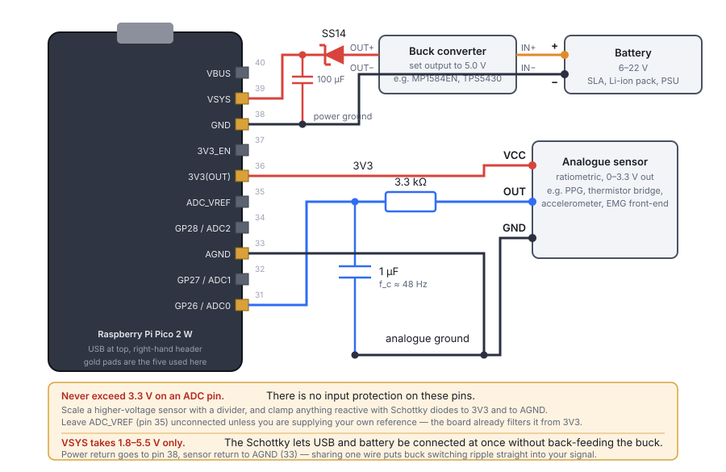

# The Pico Sensor Harness

A Raspberry Pi Pico 2 W that samples an analogue sensor, serves a web interface over
Wi-Fi, and hands captured buffers to a [FastMODA](../using-moda/web-app.md) server for
analysis. It exists so that a new sensor can be pointed at MODA's algorithms in an
afternoon — see the raw trace, decide it looks sane, run a wavelet transform on it,
all from a browser on the same network.

The firmware lives in [`pico/`](https://github.com/st7ma784/MODA/tree/main/pico).

## What it does

- **Samples** one ADC channel at a fixed rate into a ring buffer on the board.
- **Streams** that buffer to a browser as a live trace.
- **Relays** the captured window to FastMODA on request, and streams the results back.
- **Configures** its own Wi-Fi, backend server and acquisition settings from that same
  web page, with an access-point fallback so it is never unreachable.

```
 sensor ──► Pico 2 W ──► Wi-Fi ──► browser
                │                    │
                └────► FastMODA ◄────┘
                     (via the Pico)
```

The browser never talks to FastMODA directly. Every request goes through the board,
which means the API key stays on the device and FastMODA needs no CORS configuration —
the browser only ever sees one origin.

## Wiring



The RP2350 has a 12-bit SAR ADC on three pins. MicroPython's `read_u16()` reports it
left-aligned into 16 bits, so counts run 0–65535 regardless of the underlying 12 bits.

| Signal | Pico pin | GPIO | Notes |
|---|---|---|---|
| Supply in | 39 — `VSYS` | — | 1.8–5.5 V, via the Schottky. See [below](#powering-it-from-a-battery) |
| Supply return | 38 — `GND` | — | Power ground, kept off `AGND` |
| Sensor supply | 36 — `3V3(OUT)` | — | ~300 mA available; take more from `VSYS` |
| Sensor ground | 33 — `AGND` | — | Not pin 38; `AGND` is the quiet one |
| Sensor output | 31 — `GP26` | ADC0 | Default channel |
| Alternate inputs | 32, 34 | ADC1 / ADC2 | `GP27`, `GP28` — selectable in the UI |
| Reference | 35 — `ADC_VREF` | — | Leave alone unless supplying your own reference |

!!! danger "0–3.3 V, no exceptions"
    The ADC pins have no input protection. Anything above `ADC_VREF` damages them.
    Divide down a higher-voltage sensor, and clamp anything inductive or capacitive
    with Schottky diodes to `3V3` and to `AGND`.

### Powering it from a battery

The board runs off USB on the bench, but a deployed harness needs its own supply.
`VSYS` (pin 39) is the input to the Pico's onboard switching regulator and accepts
**1.8–5.5 V** — so anything from a 6 V pack to a 22 V supply has to come down to 5 V
first, through a step-down buck converter.

1. **Buck converter**, input rated well above your battery's *full-charge* voltage, not
   its nominal one — a "12 V" SLA is 13.8 V on charge, and a 5S Li-ion pack is 21 V.
   Set the output to **5.0 V** and confirm it with a meter before it goes anywhere near
   the Pico. `MP1584EN` (4.5–28 V in) and `TPS5430` (5.5–36 V in) modules both cover the
   range comfortably.
2. **Schottky diode** (`SS14`, `1N5819`) between the converter output and `VSYS`, cathode
   — the striped end — towards the Pico. This is what lets you leave USB plugged in
   while the battery is connected: `VBUS` reaches `VSYS` through the Pico's own Schottky,
   and yours stops the higher rail back-feeding into the converter's output. Without it,
   plugging in USB to reflash a running board is a gamble.
3. **100 µF bulk capacitor** from `VSYS` to `GND`, on the board side of the diode. The
   Wi-Fi radio draws in bursts, and the diode's forward drop plus any wire resistance
   turns those bursts into dips at `VSYS`.
4. **Power ground to pin 38**, not to `AGND`. They join on the board already; running one
   wire for both puts the converter's switching current through your sensor's return
   path, and the ripple lands squarely in the band you are analysing.

!!! warning "Check the output voltage before connecting"
    Buck modules ship set to whatever the last person left them at, and the adjustment
    pot has no detent at 5 V. Above 5.5 V on `VSYS` there is no protection stage — the
    regulator is the first thing the supply meets.

Budget roughly 50 mA idle, with peaks near 100 mA while the Wi-Fi transmits. Sizing the
converter for 500 mA leaves ample headroom for it and the sensor.

### Choosing the RC filter

The series resistor and capacitor form a low-pass anti-aliasing filter. Aliasing is not
cosmetic here: energy above the Nyquist frequency folds back into the band you are
analysing, and a wavelet transform will faithfully render the fold as a real
oscillation. Put the corner at roughly a quarter of the sample rate:

$$f_c = \frac{1}{2 \pi R C}$$

| Sample rate | Nyquist | Target $f_c$ | Suggested R, C |
|---|---|---|---|
| 100 Hz | 50 Hz | ~25 Hz | 6.8 kΩ, 1 µF |
| 200 Hz | 100 Hz | ~48 Hz | 3.3 kΩ, 1 µF |
| 500 Hz | 250 Hz | ~120 Hz | 1.3 kΩ, 1 µF |
| 1000 Hz | 500 Hz | ~240 Hz | 6.8 kΩ, 100 nF |

Keep R below about 10 kΩ. The ADC's sample-and-hold has to charge its own capacitance
through whatever source impedance you give it, and a large R shows up as a gain error
that is easy to mistake for a sensor problem.

### Bill of materials

| Item | Notes |
|---|---|
| Raspberry Pi Pico 2 W | The wireless part is not optional |
| Analogue sensor, 0–3.3 V out | Ratiometric sensors track `3V3(OUT)` and drift less |
| Resistor and capacitor | Per the RC table above |
| Buck converter module | Input rated above the battery's full-charge voltage; output set to 5.0 V |
| Schottky diode | `SS14` or `1N5819`, between the converter and `VSYS` |
| 100 µF capacitor | Bulk, across `VSYS` and `GND` |
| Battery, up to 22 V | SLA, Li-ion pack, or a bench supply |
| Breadboard and jumper wires | Or solder to the castellations |
| Micro-USB cable | Bench power and flashing |

## Flashing

1. Install MicroPython. Hold `BOOTSEL`, plug the board in, and drop the Pico 2 W
   `.uf2` from [micropython.org/download](https://micropython.org/download/) onto the
   `RPI-RP2` drive.
2. Copy the firmware across with [`mpremote`](https://docs.micropython.org/en/latest/reference/mpremote.html):

    ```bash
    pip install mpremote
    cd pico/firmware
    mpremote fs mkdir :www
    mpremote fs cp main.py config.py sampler.py netcfg.py proxy.py server.py :
    mpremote fs cp www/index.html www/app.js www/style.css :www/
    mpremote reset
    ```

3. Watch it boot with `mpremote repl` — it prints the URL it is serving on.

## First boot

With no credentials stored, the board raises its own access point:

- **Network:** `moda-pico`
- **Password:** `modamoda`
- **Address:** `http://192.168.4.1/`

Join it, open that address, and fill in the **Settings** tab: your Wi-Fi network, and
the FastMODA server URL. Save, then reboot the board — it will join the network you
gave it and print its new address to the REPL. If it cannot, it comes back as an access
point rather than disappearing.

Change the AP password before using this anywhere shared. It is a default, and it is
published in this document.

## The web interface

### Signal

The live trace, straight off the ADC, converted to volts against `ADC_VREF`. Nothing is
filtered on the board — what you see is exactly what gets uploaded.

Use it to answer the questions that come before any analysis: is the sensor centred in
its range or clipping at a rail? Is there mains hum? Does the amplitude respond when you
disturb the thing being measured? A `samples dropped` counter appears if the browser
cannot keep up with the sample rate, which tells you the trace has gaps in it — the
uploaded buffer does not, since dropping happens on the way out, not on the way in.

### Analysis

Pick a FastMODA route, set its parameters, and press **Run on FastMODA**. The board
uploads the most recent N samples as a one-column CSV, then polls the job and streams
the result back.

Available routes: CWT, WFT, STFT, Hilbert, ridge extraction, changepoints, MODWT,
feature vectors, and Butterworth filtering. The sampling frequency is always taken from
the device rather than the form — FastMODA reads `fs = 1.0` out of a CSV, so every
frequency axis downstream depends on the board getting this right.

Figures are drawn by a small canvas renderer built into the page, not by Plotly: the
board serves this UI from its own flash and is often on a network with no route to a
CDN. Heatmaps and line traces render; anything more exotic is available under **Raw JSON
from FastMODA**, along with every scalar the endpoint returned.

### Settings

Wi-Fi credentials and the fallback AP, the FastMODA URL and API key (with a **Test
connection** button), the device ID, and the acquisition parameters — channel, sample
rate, buffer length, and the `ADC_VREF` value used to convert counts to volts.

Acquisition changes apply immediately and clear the buffer. Wi-Fi changes need a reboot;
the page says so when you save one. Secrets are never sent back to the browser: password
fields show `unchanged`, and leaving one blank keeps what is stored.

## Sizing the buffer

The ring buffer is `sample_rate × buffer_seconds` samples of 2 bytes each, preallocated
at boot. Keep the total under about 60000 samples (120 KB) to leave the network stack
and the relay room to work.

| Sample rate | Buffer | Samples | RAM |
|---|---|---|---|
| 100 Hz | 60 s | 6000 | 12 KB |
| 200 Hz | 20 s | 4000 | 8 KB |
| 500 Hz | 30 s | 15000 | 30 KB |
| 1000 Hz | 60 s | 60000 | 120 KB |

Sampling is driven by a MicroPython timer callback. Past roughly 2 kHz the callback
starts to slip and the sample interval stops being uniform, which quietly invalidates
every frequency axis downstream — so that is where the UI caps it. If you need faster,
the ADC itself does 500 kS/s and the honest route is free-running DMA capture, which
means writing that part in C.

## Developing without hardware

`pico/tools/host_sim.py` runs the firmware on a laptop against a synthetic sensor — two
sinusoids in the 0.1–2 Hz band plus noise. Only the ADC and the Wi-Fi module are
substituted; the HTTP server, the config round-trip and the FastMODA relay are the same
code that runs on the board.

```bash
python pico/tools/host_sim.py --backend http://scc-hdd-01.lancs.ac.uk:5000
# then open http://localhost:8080/
```

## Tests

```bash
cd pico
pip install pytest pytest-asyncio
pytest
```

The suite covers the ring buffer's wrap and drop semantics, config validation and
secret masking, the fixed-width CSV encoding that makes streamed uploads possible, and
an end-to-end pass over a real socket against a stub FastMODA — including that the
relay carries a response larger than the board could ever buffer.


## Limits

- **Plain HTTP only.** The board streams responses it has no room to buffer, and TLS on
  a Pico cannot keep up. Use it on a lab network, not across the open internet.
- **No authentication on the board's own web UI.** Anyone who can reach it can
  reconfigure it. The API key protects FastMODA, not the Pico.
- **One channel.** The ring buffer, the CSV encoder and the UI all assume a single
  signal. Multi-channel means interleaving in the buffer and a wider CSV.
- **No local storage.** The buffer is RAM; a power cut loses it. Recordings worth
  keeping should be pushed to FastMODA's `/recordings` endpoint.
