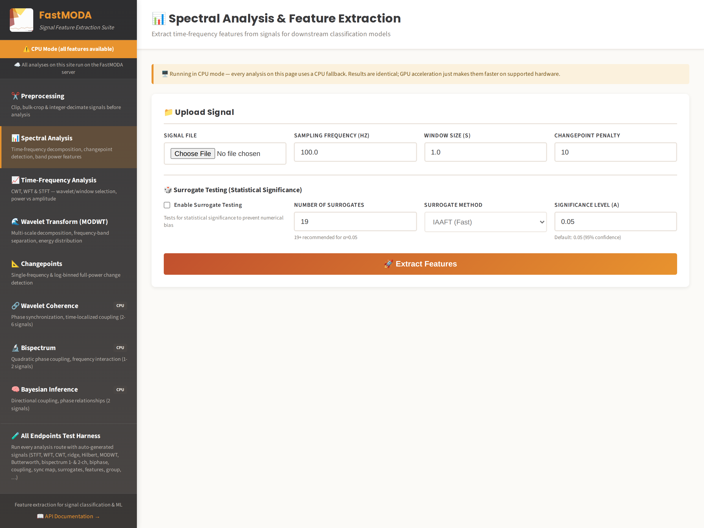
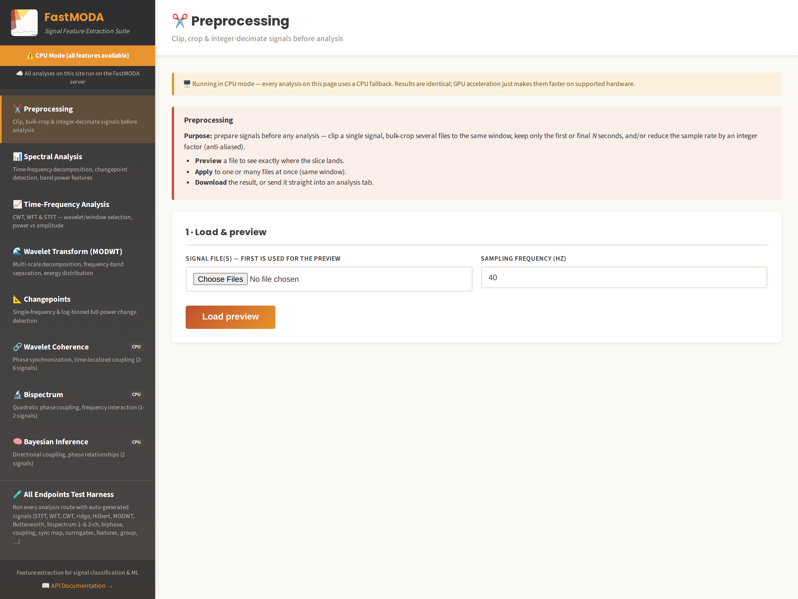
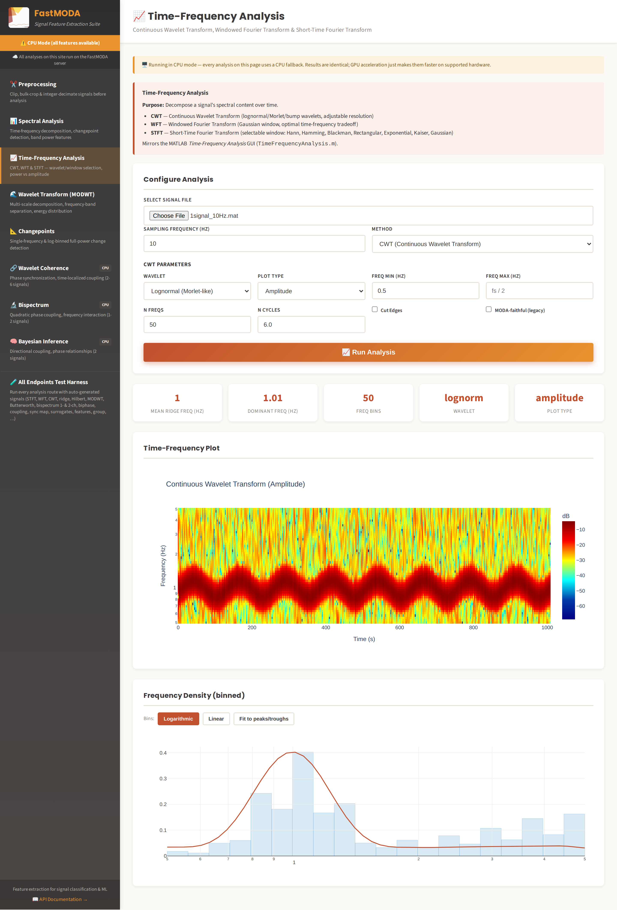
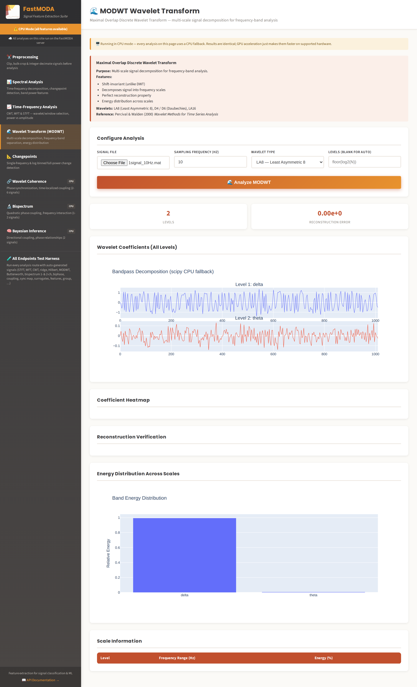
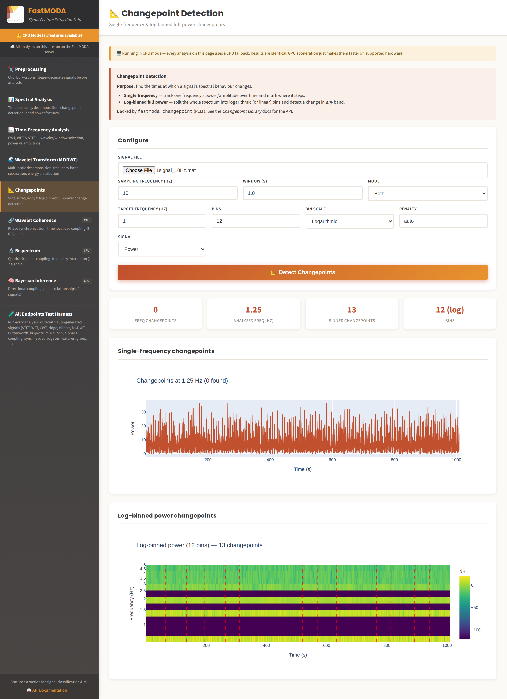
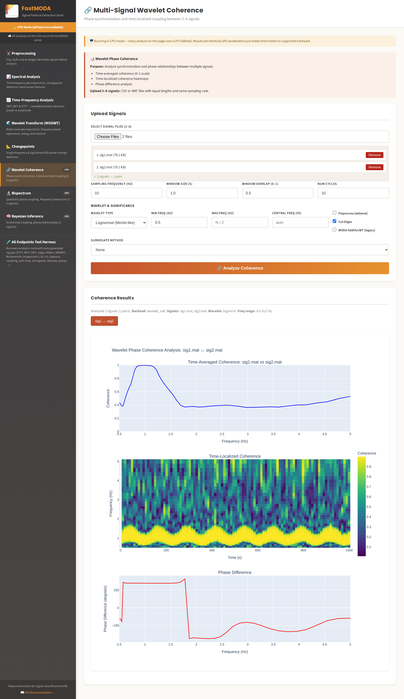
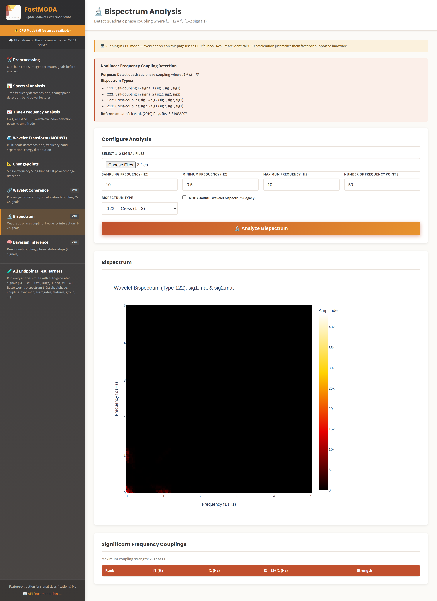
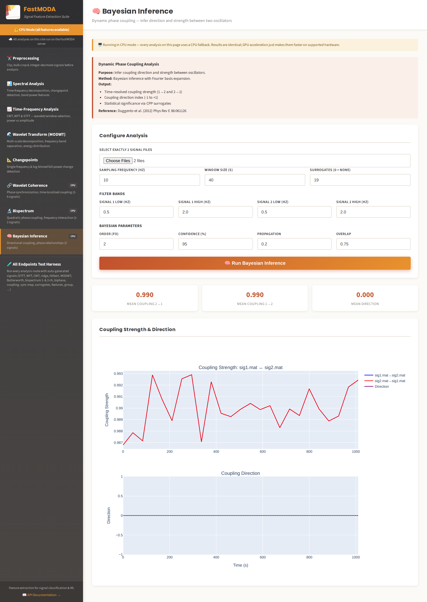

# The Web App (FastMODA)

FastMODA is a Flask-based web application and REST API that exposes MODA's algorithms
for browser-based and programmatic use, including GPU-accelerated variants and
machine-learning feature extraction.



## Running it

```bash
cd FastMODA
pip install -r requirements.txt
python app.py
```

By default this serves the app at `http://localhost:5000`. See
[Installation](../getting-started/installation.md#fastmoda-web-app-requirements) for
prerequisites.

Alternatively, run the whole stack (app plus its Redis job broker) with Docker Compose:

```bash
docker compose up -d fastmoda
```

## The shell

Every page shares the same layout: a fixed left sidebar listing each analysis, and a
main pane holding a **Configure Analysis** form above a results area. A banner at the
top of the sidebar reports whether the server is in GPU or **CPU mode** — results are
identical either way; GPU only affects speed.

The workflow is the same throughout:

1. Choose a signal file (or several, for the multi-signal analyses).
2. Set the **sampling frequency** — this is not read from the file, and every frequency
   axis depends on it.
3. Adjust parameters, then press the run button.
4. Results render below as interactive Plotly charts (zoom, pan, hover, export to PNG).

!!! warning "Set the sampling frequency before running"
    The field defaults to `1.0`, not to the file's real rate. Leaving it wrong doesn't
    fail — it silently rescales every frequency axis, so a 10 Hz recording analysed at
    `fs = 1.0` produces a plausible-looking but meaningless plot.

## Preprocessing



Clip, bulk-crop and integer-decimate signals before analysis. Preview the effect before
committing; the preprocessed signal is then available to the other pages by token.
Useful for trimming transients at the start of a recording, or decimating an
over-sampled signal so the analyses run faster.

## Spectral Analysis

The landing page (`/`) — time-frequency decomposition, band-power features and
changepoint detection in one pass. This is the endpoint the
[ML feature-extraction workflow](../api-and-ml/training-a-classifier.md) is built on.

## Time-Frequency Analysis



CWT, WFT and STFT with selectable wavelet/window, frequency range, number of
frequencies and resolution parameter — mirroring the desktop app's
`TimeFrequencyAnalysis.m`. See
[Time-Frequency Analysis](../algorithms/time-frequency-analysis.md) for what the
parameters mean.

The **MODA-faithful (legacy)** checkbox switches to a transform that reproduces the
MATLAB `wt.m` output; see
[Algorithmic Differences](../validation/algorithmic-differences.md) for why the default
path differs and when the distinction matters.

## Wavelet Transform (MODWT)



Maximal-overlap discrete wavelet transform: multi-scale decomposition into
frequency bands with an energy-per-scale breakdown. Unlike the CWT this is a dyadic,
shift-invariant decomposition — better suited to separating a signal into a handful of
octave bands than to tracing a continuously-varying frequency.

## Changepoints



Detects times at which the signal's spectral content changes, in two modes:
single-frequency and log-binned full-power. See
[Changepoint Library](../roadmap/changepoints.md) for the method and its MODA parity.

## Wavelet Coherence



Phase synchronization and time-localized coupling across 2–6 signals, computing every
pairwise combination. See
[Wavelet Phase Coherence](../algorithms/wavelet-phase-coherence.md).

!!! note "One signal per file"
    The multi-signal pages (coherence, bispectrum, Bayesian) expect **one signal per
    uploaded file**, selected together. A single `.mat` containing several channels is
    rejected with *"At least 2 signals required"* — split it into separate files first.
    All signals must share a length and sampling rate.

## Bispectrum



Quadratic phase coupling on 1–2 signals, with the `111`/`112`/`122`/`222` type
selection described in [Wavelet Bispectrum](../algorithms/wavelet-bispectrum.md). Cost
grows quadratically with the number of frequencies, so start coarse.

## Bayesian Inference



Directional coupling and phase relationships between two signals, with an
`n_surrogates` parameter for significance testing. See
[Dynamical Bayesian Inference](../algorithms/dynamical-bayesian-inference.md).

## All Endpoints Test Harness

The `/tests` page runs every analysis route against auto-generated signals — STFT, WFT,
CWT, ridge, Hilbert, MODWT, Butterworth, bispectrum, biphase, coupling, sync map,
surrogates, features, group analysis. It's the quickest way to confirm a deployment is
healthy and to see the shape of each endpoint's response without preparing data.

## Uploading data

Accepted file formats: `.mat` (reads the `sig` or `signal` variable), `.npy`, and
`.csv` (first column used). Multi-signal endpoints (coherence, bispectrum, Bayesian)
accept multiple file uploads in one request, one signal each.

## Using it programmatically

Everything the browser UI does is backed by the plain REST API described in
[REST API Reference](../api-and-ml/rest-api-reference.md) — the browser is just one
client of it. See [Programmatic Usage](../api-and-ml/programmatic-usage.md) for calling
it directly from Python, and [Training a Classifier](../api-and-ml/training-a-classifier.md)
for turning its output into ML features.

Long-running analyses return a `task_id` immediately and are polled via
`GET /status/<task_id>` — which is exactly what the browser pages do.

## GPU acceleration

Coherence, bispectrum, and Bayesian inference endpoints can use GPU acceleration via
PyTorch when available. Check availability with `GET /api/gpu-info`, and control it
with the `USE_GPU` environment variable (`auto` | `true` | `false`).
